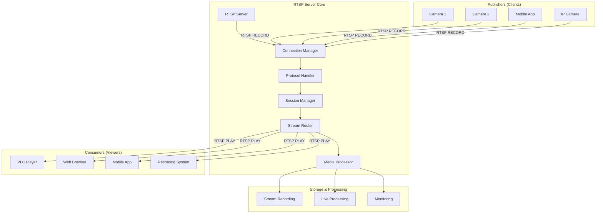
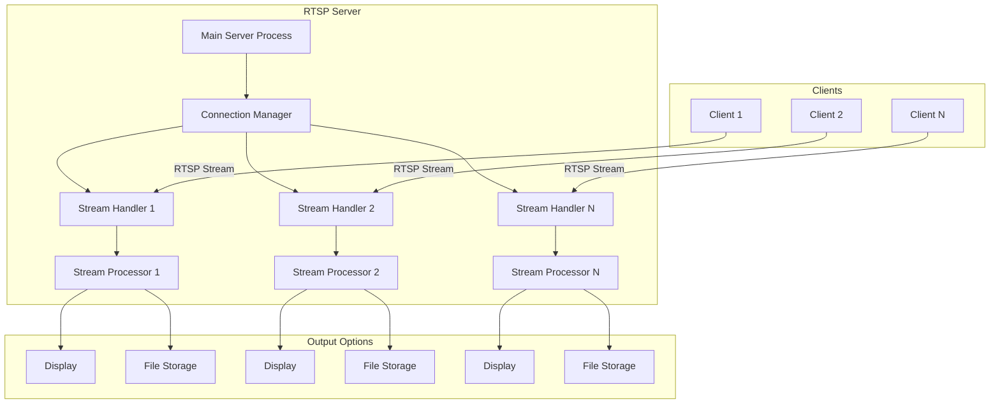
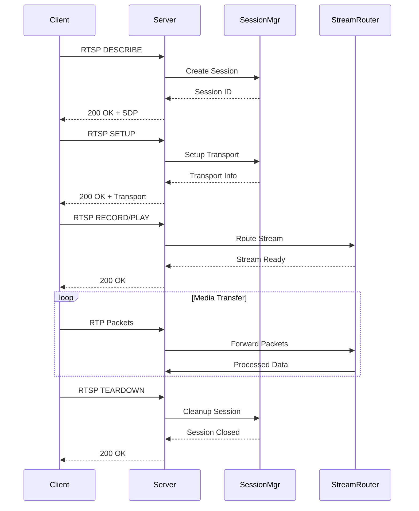

# Real-Time RTSP Server Application

## Overview
This project implements a comprehensive Real-Time Streaming Protocol (RTSP) server in Python that can accept incoming video streams from multiple clients simultaneously. Unlike simple stream aggregators, this is a true RTSP server that implements the RTSP protocol specification (RFC 2326) and can handle authentic RTSP client connections.

The server operates in a client-server model where:
- **Server**: Listens on a specified port for incoming RTSP connections
- **Clients**: Connect to the server and publish their video streams via RTSP
- **Viewers**: Can connect to consume the published streams

### Key Features
- **True RTSP Protocol Implementation**: Handles RTSP handshake, commands (DESCRIBE, SETUP, PLAY, RECORD, etc.)
- **Multi-client Stream Publishing**: Accept multiple clients publishing streams simultaneously
- **Stream Consumption**: Allow viewers to connect and consume published streams
- **Real-time Processing**: Live video processing and routing capabilities
- **Session Management**: Proper RTSP session handling with authentication
- **Stream Recording**: Optional recording of published streams
- **Load Balancing**: Distribute viewer connections across available streams
- **Monitoring Dashboard**: Real-time statistics and stream management

## Architecture Overview




## Detailed System Architecture

### 1. RTSP Protocol Implementation



### 2. Core Components

#### A. RTSP Server (`RTSPServer` class)

```python
class RTSPServer:
    def __init__(self, host='0.0.0.0', port=554, max_publishers=10, 
                 max_viewers=50, auth_required=True, recording_path=None):
        self.host = host
        self.port = port
        self.max_publishers = max_publishers
        self.max_viewers = max_viewers
        self.auth_required = auth_required
        self.recording_path = recording_path
        
        # Core components
        self.connection_manager = ConnectionManager(self)
        self.protocol_handler = RTSPProtocolHandler(self)
        self.session_manager = SessionManager(self)
        self.stream_router = StreamRouter(self)
        self.media_processor = MediaProcessor(self)
        
        # Server state
        self.running = False
        self.server_socket = None
        self.published_streams = {}
        self.active_sessions = {}
        
        # Threading
        self.executor = ThreadPoolExecutor(max_workers=max_publishers + max_viewers)
        self.lock = threading.RLock()
```

**Key Responsibilities:**
1. **Network Binding**: Bind to specified host/port and listen for connections
2. **Connection Acceptance**: Accept incoming TCP connections from RTSP clients
3. **Component Coordination**: Manage interaction between all server components
4. **Resource Management**: Handle server resources and cleanup
5. **Configuration Management**: Maintain server configuration and limits

#### B. Connection Manager (`ConnectionManager` class)

```python
class ConnectionManager:
    def __init__(self, server):
        self.server = server
        self.active_connections = {}
        self.connection_counter = 0
        
    def accept_connections(self):
        """Main connection acceptance loop"""
        while self.server.running:
            try:
                client_socket, address = self.server.server_socket.accept()
                with self.server.lock:
                    self.connection_counter += 1
                    conn_id = self.connection_counter
                    
                connection = RTSPConnection(conn_id, client_socket, address, self.server)
                self.active_connections[conn_id] = connection
                
                # Handle connection in separate thread
                self.server.executor.submit(self.handle_connection, connection)
                
            except Exception as e:
                if self.server.running:
                    print(f"Error accepting connection: {e}")
    
    def handle_connection(self, connection):
        """Handle individual RTSP connection"""
        try:
            connection.start()
        except Exception as e:
            print(f"Connection {connection.id} error: {e}")
        finally:
            self.cleanup_connection(connection.id)
```

**Features:**
1. **Connection Acceptance**: Listen for and accept incoming TCP connections
2. **Connection Tracking**: Maintain registry of active connections
3. **Load Management**: Monitor connection limits and reject excess connections
4. **Connection Lifecycle**: Handle connection establishment and cleanup

#### C. RTSP Protocol Handler (`RTSPProtocolHandler` class)

```python
class RTSPProtocolHandler:
    def __init__(self, server):
        self.server = server
        self.supported_methods = ['DESCRIBE', 'SETUP', 'PLAY', 'RECORD', 'TEARDOWN', 'OPTIONS']
        
    def parse_request(self, request_data):
        """Parse RTSP request"""
        lines = request_data.decode('utf-8').strip().split('\r\n')
        request_line = lines[0]
        
        # Parse request line: METHOD rtsp://host:port/path RTSP/1.0
        parts = request_line.split(' ')
        method = parts[0]
        url = parts[1]
        version = parts[2]
        
        # Parse headers
        headers = {}
        for line in lines[1:]:
            if ':' in line:
                key, value = line.split(':', 1)
                headers[key.strip()] = value.strip()
        
        return {
            'method': method,
            'url': url,
            'version': version,
            'headers': headers
        }
    
    def handle_describe(self, connection, request):
        """Handle DESCRIBE request - return SDP"""
        stream_path = self.extract_stream_path(request['url'])
        
        # Generate SDP (Session Description Protocol)
        sdp = self.generate_sdp(stream_path)
        
        response = self.build_response(200, 'OK', {
            'Content-Type': 'application/sdp',
            'Content-Length': str(len(sdp)),
            'CSeq': request['headers'].get('CSeq', '1')
        }, sdp)
        
        return response
    
    def handle_setup(self, connection, request):
        """Handle SETUP request - establish transport"""
        stream_path = self.extract_stream_path(request['url'])
        transport_header = request['headers'].get('Transport', '')
        
        # Parse transport parameters
        transport_params = self.parse_transport(transport_header)
        
        # Create session
        session = self.server.session_manager.create_session(
            connection, stream_path, transport_params
        )
        
        response_transport = f"RTP/AVP;unicast;client_port={transport_params['client_port']};server_port={session.server_port}"
        
        response = self.build_response(200, 'OK', {
            'Transport': response_transport,
            'Session': session.session_id,
            'CSeq': request['headers'].get('CSeq', '1')
        })
        
        return response
    
    def handle_record(self, connection, request):
        """Handle RECORD request - start receiving stream"""
        session_id = request['headers'].get('Session', '')
        session = self.server.session_manager.get_session(session_id)
        
        if not session:
            return self.build_response(454, 'Session Not Found', {
                'CSeq': request['headers'].get('CSeq', '1')
            })
        
        # Start recording stream
        self.server.stream_router.start_publishing(session)
        
        response = self.build_response(200, 'OK', {
            'Session': session_id,
            'CSeq': request['headers'].get('CSeq', '1')
        })
        
        return response
    
    def handle_play(self, connection, request):
        """Handle PLAY request - start sending stream"""
        session_id = request['headers'].get('Session', '')
        session = self.server.session_manager.get_session(session_id)
        
        if not session:
            return self.build_response(454, 'Session Not Found', {
                'CSeq': request['headers'].get('CSeq', '1')
            })
        
        # Start playing stream
        self.server.stream_router.start_consuming(session)
        
        response = self.build_response(200, 'OK', {
            'Session': session_id,
            'CSeq': request['headers'].get('CSeq', '1')
        })
        
        return response
```

**Protocol Features:**
1. **Request Parsing**: Parse RTSP requests according to RFC 2326
2. **Method Handling**: Implement all required RTSP methods
3. **Response Generation**: Generate proper RTSP responses
4. **SDP Generation**: Create Session Description Protocol messages
5. **Transport Negotiation**: Handle RTP/RTCP transport setup

#### D. Session Manager (`SessionManager` class)

```python
class SessionManager:
    def __init__(self, server):
        self.server = server
        self.sessions = {}
        self.session_counter = 0
        self.port_pool = PortPool(10000, 20000)  # RTP port range
        
    def create_session(self, connection, stream_path, transport_params):
        """Create new RTSP session"""
        with self.server.lock:
            self.session_counter += 1
            session_id = f"session_{self.session_counter}_{int(time.time())}"
            
            # Allocate RTP ports
            server_port = self.port_pool.allocate_port_pair()
            
            session = RTSPSession(
                session_id=session_id,
                connection=connection,
                stream_path=stream_path,
                transport_params=transport_params,
                server_port=server_port,
                created_at=time.time()
            )
            
            self.sessions[session_id] = session
            return session
    
    def get_session(self, session_id):
        """Get session by ID"""
        return self.sessions.get(session_id)
    
    def cleanup_session(self, session_id):
        """Clean up session resources"""
        session = self.sessions.get(session_id)
        if session:
            # Return ports to pool
            self.port_pool.release_port_pair(session.server_port)
            
            # Clean up stream resources
            self.server.stream_router.cleanup_session(session)
            
            # Remove from registry
            del self.sessions[session_id]
            
            print(f"Session {session_id} cleaned up")
```

**Session Features:**
1. **Session Creation**: Generate unique session IDs and manage lifecycle
2. **Port Management**: Allocate and manage RTP/RTCP port pairs
3. **Resource Tracking**: Track resources associated with each session
4. **Session Cleanup**: Proper cleanup of session resources
5. **Session Persistence**: Maintain session state across requests

#### E. Stream Router (`StreamRouter` class)

```python
class StreamRouter:
    def __init__(self, server):
        self.server = server
        self.published_streams = {}  # stream_path -> PublishedStream
        self.consuming_sessions = {}  # session_id -> ConsumingSession
        self.rtp_processors = {}  # session_id -> RTPProcessor
        
    def start_publishing(self, session):
        """Start publishing stream from client"""
        stream_path = session.stream_path
        
        if stream_path not in self.published_streams:
            # Create new published stream
            published_stream = PublishedStream(
                stream_path=stream_path,
                publisher_session=session,
                created_at=time.time()
            )
            
            self.published_streams[stream_path] = published_stream
            
            # Start RTP receiver
            rtp_processor = RTPProcessor(session, self.server)
            rtp_processor.start_receiving()
            self.rtp_processors[session.session_id] = rtp_processor
            
            print(f"Started publishing stream: {stream_path}")
        else:
            # Stream already exists - reject
            raise Exception(f"Stream {stream_path} already being published")
    
    def start_consuming(self, session):
        """Start consuming stream for viewer"""
        stream_path = session.stream_path
        
        if stream_path not in self.published_streams:
            raise Exception(f"Stream {stream_path} not available")
        
        published_stream = self.published_streams[stream_path]
        
        # Add consumer to stream
        consumer = StreamConsumer(
            session=session,
            published_stream=published_stream
        )
        
        published_stream.add_consumer(consumer)
        self.consuming_sessions[session.session_id] = consumer
        
        # Start RTP sender
        rtp_processor = RTPProcessor(session, self.server)
        rtp_processor.start_sending(published_stream)
        self.rtp_processors[session.session_id] = rtp_processor
        
        print(f"Started consuming stream: {stream_path}")
    
    def route_rtp_packet(self, session_id, rtp_packet):
        """Route RTP packet from publisher to consumers"""
        # Find published stream by publisher session
        published_stream = None
        for stream in self.published_streams.values():
            if stream.publisher_session.session_id == session_id:
                published_stream = stream
                break
        
        if published_stream:
            # Forward packet to all consumers
            for consumer in published_stream.consumers:
                consumer.send_rtp_packet(rtp_packet)
            
            # Process for recording if enabled
            if self.server.recording_path:
                self.server.media_processor.record_packet(published_stream.stream_path, rtp_packet)
```

**Routing Features:**
1. **Stream Publishing**: Handle clients publishing their streams
2. **Stream Consumption**: Manage viewers consuming published streams
3. **Packet Routing**: Route RTP packets from publishers to consumers
4. **Stream Registry**: Maintain registry of active streams
5. **Load Balancing**: Distribute viewer load across available streams

#### F. Media Processor (`MediaProcessor` class)

```python
class MediaProcessor:
    def __init__(self, server):
        self.server = server
        self.recorders = {}  # stream_path -> VideoRecorder
        self.processors = {}  # stream_path -> CustomProcessor
        
    def record_packet(self, stream_path, rtp_packet):
        """Record RTP packet to file"""
        if stream_path not in self.recorders:
            # Create new recorder
            recorder = VideoRecorder(
                stream_path=stream_path,
                output_path=os.path.join(self.server.recording_path, f"{stream_path}.mp4")
            )
            self.recorders[stream_path] = recorder
        
        recorder = self.recorders[stream_path]
        recorder.write_packet(rtp_packet)
    
    def process_stream(self, stream_path, frame_data):
        """Apply custom processing to stream"""
        if stream_path in self.processors:
            processor = self.processors[stream_path]
            return processor.process_frame(frame_data)
        
        return frame_data
    
    def add_stream_processor(self, stream_path, processor):
        """Add custom processor for stream"""
        self.processors[stream_path] = processor
```

## Complete Implementation

### 1. Main Server Code

```python
# rtsp_server.py
import socket
import threading
import time
import os
import struct
from concurrent.futures import ThreadPoolExecutor
from dataclasses import dataclass
from typing import Dict, List, Optional

@dataclass
class RTSPSession:
    session_id: str
    connection: 'RTSPConnection'
    stream_path: str
    transport_params: Dict
    server_port: int
    created_at: float
    state: str = 'INIT'  # INIT, READY, PLAYING, RECORDING

class RTSPConnection:
    def __init__(self, conn_id, socket, address, server):
        self.id = conn_id
        self.socket = socket
        self.address = address
        self.server = server
        self.running = True
        
    def start(self):
        """Start handling connection"""
        print(f"New connection {self.id} from {self.address}")
        
        while self.running:
            try:
                # Read RTSP request
                data = self.socket.recv(4096)
                if not data:
                    break
                
                # Parse and handle request
                request = self.server.protocol_handler.parse_request(data)
                response = self.server.protocol_handler.handle_request(self, request)
                
                # Send response
                self.socket.send(response.encode('utf-8'))
                
            except Exception as e:
                print(f"Connection {self.id} error: {e}")
                break
        
        self.cleanup()
    
    def cleanup(self):
        """Clean up connection resources"""
        try:
            self.socket.close()
        except:
            pass
        self.running = False

class RTSPServer:
    def __init__(self, host='0.0.0.0', port=554, max_publishers=10, 
                 max_viewers=50, auth_required=False, recording_path=None):
        self.host = host
        self.port = port
        self.max_publishers = max_publishers
        self.max_viewers = max_viewers
        self.auth_required = auth_required
        self.recording_path = recording_path
        
        # Initialize components
        self.connection_manager = ConnectionManager(self)
        self.protocol_handler = RTSPProtocolHandler(self)
        self.session_manager = SessionManager(self)
        self.stream_router = StreamRouter(self)
        self.media_processor = MediaProcessor(self)
        
        # Server state
        self.running = False
        self.server_socket = None
        self.executor = ThreadPoolExecutor(max_workers=max_publishers + max_viewers)
        self.lock = threading.RLock()
        
        # Statistics
        self.stats = {
            'connections': 0,
            'active_publishers': 0,
            'active_viewers': 0,
            'total_bytes': 0,
            'uptime': 0
        }
    
    def start(self):
        """Start RTSP server"""
        try:
            # Create server socket
            self.server_socket = socket.socket(socket.AF_INET, socket.SOCK_STREAM)
            self.server_socket.setsockopt(socket.SOL_SOCKET, socket.SO_REUSEADDR, 1)
            self.server_socket.bind((self.host, self.port))
            self.server_socket.listen(10)
            
            self.running = True
            start_time = time.time()
            
            print(f"RTSP Server started on {self.host}:{self.port}")
            print(f"Max publishers: {self.max_publishers}")
            print(f"Max viewers: {self.max_viewers}")
            print(f"Recording: {'Enabled' if self.recording_path else 'Disabled'}")
            print("Server ready for connections...")
            
            # Start connection acceptance in separate thread
            self.executor.submit(self.connection_manager.accept_connections)
            
            # Start monitoring thread
            self.executor.submit(self.monitor_server)
            
            # Keep main thread alive
            try:
                while self.running:
                    time.sleep(1)
                    self.stats['uptime'] = time.time() - start_time
            except KeyboardInterrupt:
                print("\nShutting down server...")
                
        except Exception as e:
            print(f"Failed to start server: {e}")
        finally:
            self.shutdown()
    
    def shutdown(self):
        """Shutdown server gracefully"""
        self.running = False
        
        # Close server socket
        if self.server_socket:
            self.server_socket.close()
        
        # Shutdown executor
        self.executor.shutdown(wait=True)
        
        # Cleanup sessions
        for session_id in list(self.session_manager.sessions.keys()):
            self.session_manager.cleanup_session(session_id)
        
        print("Server shutdown complete")
    
    def monitor_server(self):
        """Monitor server statistics"""
        while self.running:
            time.sleep(30)  # Print stats every 30 seconds
            
            with self.lock:
                print(f"\n--- Server Statistics ---")
                print(f"Uptime: {self.stats['uptime']:.1f}s")
                print(f"Active publishers: {self.stats['active_publishers']}")
                print(f"Active viewers: {self.stats['active_viewers']}")
                print(f"Total connections: {self.stats['connections']}")
                print(f"Published streams: {len(self.stream_router.published_streams)}")
                print(f"Active sessions: {len(self.session_manager.sessions)}")
                print("-" * 25)

if __name__ == "__main__":
    # Configuration
    server = RTSPServer(
        host='0.0.0.0',
        port=554,
        max_publishers=10,
        max_viewers=50,
        auth_required=False,
        recording_path="recordings"
    )
    
    server.start()
```

### 2. Usage Examples

#### Publishing Stream (Client Side)

```python
# publisher_client.py
import cv2
import socket
import time

class RTSPPublisher:
    def __init__(self, server_host, server_port, stream_path):
        self.server_host = server_host
        self.server_port = server_port
        self.stream_path = stream_path
        self.session_id = None
        self.socket = None
        
    def connect(self):
        """Connect to RTSP server"""
        self.socket = socket.socket(socket.AF_INET, socket.SOCK_STREAM)
        self.socket.connect((self.server_host, self.server_port))
        
        # Send DESCRIBE request
        describe_request = f"""DESCRIBE rtsp://{self.server_host}:{self.server_port}/{self.stream_path} RTSP/1.0\r
CSeq: 1\r
User-Agent: RTSPPublisher/1.0\r
\r
"""
        self.socket.send(describe_request.encode())
        response = self.socket.recv(4096)
        print("DESCRIBE response:", response.decode())
        
        # Send SETUP request
        setup_request = f"""SETUP rtsp://{self.server_host}:{self.server_port}/{self.stream_path} RTSP/1.0\r
CSeq: 2\r
Transport: RTP/AVP;unicast;client_port=8000-8001\r
\r
"""
        self.socket.send(setup_request.encode())
        response = self.socket.recv(4096)
        print("SETUP response:", response.decode())
        
        # Extract session ID from response
        for line in response.decode().split('\r\n'):
            if line.startswith('Session:'):
                self.session_id = line.split(':')[1].strip()
                break
        
        # Send RECORD request
        record_request = f"""RECORD rtsp://{self.server_host}:{self.server_port}/{self.stream_path} RTSP/1.0\r
CSeq: 3\r
Session: {self.session_id}\r
\r
"""
        self.socket.send(record_request.encode())
        response = self.socket.recv(4096)
        print("RECORD response:", response.decode())
    
    def publish_webcam(self):
        """Publish webcam stream"""
        cap = cv2.VideoCapture(0)
        
        while True:
            ret, frame = cap.read()
            if not ret:
                break
            
            # Convert frame to bytes and send via RTP
            # (This is simplified - real implementation would use proper RTP packaging)
            frame_bytes = cv2.imencode('.jpg', frame)[1].tobytes()
            
            # Send RTP packet (simplified)
            # In real implementation, this would be sent via UDP to allocated port
            
            time.sleep(0.033)  # ~30 FPS
        
        cap.release()

# Usage
if __name__ == "__main__":
    publisher = RTSPPublisher("localhost", 554, "webcam1")
    publisher.connect()
    publisher.publish_webcam()
```

#### Consuming Stream (Viewer Side)

```python
# viewer_client.py
import socket
import cv2
import numpy as np

class RTSPViewer:
    def __init__(self, server_host, server_port, stream_path):
        self.server_host = server_host
        self.server_port = server_port
        self.stream_path = stream_path
        self.session_id = None
        self.socket = None
        
    def connect(self):
        """Connect to RTSP server"""
        self.socket = socket.socket(socket.AF_INET, socket.SOCK_STREAM)
        self.socket.connect((self.server_host, self.server_port))
        
        # Send DESCRIBE request
        describe_request = f"""DESCRIBE rtsp://{self.server_host}:{self.server_port}/{self.stream_path} RTSP/1.0\r
CSeq: 1\r
User-Agent: RTSPViewer/1.0\r
\r
"""
        self.socket.send(describe_request.encode())
        response = self.socket.recv(4096)
        print("DESCRIBE response:", response.decode())
        
        # Send SETUP request
        setup_request = f"""SETUP rtsp://{self.server_host}:{self.server_port}/{self.stream_path} RTSP/1.0\r
CSeq: 2\r
Transport: RTP/AVP;unicast;client_port=9000-9001\r
\r
"""
        self.socket.send(setup_request.encode())
        response = self.socket.recv(4096)
        print("SETUP response:", response.decode())
        
        # Extract session ID
        for line in response.decode().split('\r\n'):
            if line.startswith('Session:'):
                self.session_id = line.split(':')[1].strip()
                break
        
        # Send PLAY request
        play_request = f"""PLAY rtsp://{self.server_host}:{self.server_port}/{self.stream_path} RTSP/1.0\r
CSeq: 3\r
Session: {self.session_id}\r
\r
"""
        self.socket.send(play_request.encode())
        response = self.socket.recv(4096)
        print("PLAY response:", response.decode())
    
    def view_stream(self):
        """View the stream"""
        # In real implementation, this would receive RTP packets via UDP
        # and decode them to display video
        print(f"Viewing stream: {self.stream_path}")
        print("Press 'q' to quit")
        
        while True:
            # Simulate receiving and displaying frames
            # Real implementation would decode RTP packets
            key = cv2.waitKey(30) & 0xFF
            if key == ord('q'):
                break
        
        cv2.destroyAllWindows()

# Usage
if __name__ == "__main__":
    viewer = RTSPViewer("localhost", 554, "webcam1")
    viewer.connect()
    viewer.view_stream()
```

### 3. Testing with Standard Tools

#### Using FFmpeg to Publish

```bash
# Publish webcam stream
ffmpeg -f v4l2 -i /dev/video0 -c:v libx264 -f rtsp rtsp://localhost:554/webcam1

# Publish video file
ffmpeg -re -i input.mp4 -c:v copy -f rtsp rtsp://localhost:554/video1

# Publish with custom parameters
ffmpeg -f v4l2 -i /dev/video0 -c:v libx264 -preset ultrafast -tune zerolatency -f rtsp rtsp://localhost:554/live1
```

#### Using VLC to View

```bash
# View published stream
vlc rtsp://localhost:554/webcam1

# View with specific options
vlc --intf dummy --play-and-exit rtsp://localhost:554/video1
```

#### Using GStreamer

```bash
# Publish with GStreamer
gst-launch-1.0 v4l2src device=/dev/video0 ! videoconvert ! x264enc ! rtph264pay ! udpsink host=localhost port=554

# View with GStreamer
gst-launch-1.0 rtspsrc location=rtsp://localhost:554/webcam1 ! decodebin ! autovideosink
```

## Advanced Features

### 1. Authentication System

```python
class AuthenticationManager:
    def __init__(self):
        self.users = {}  # username -> password_hash
        self.tokens = {}  # token -> user_info
        
    def authenticate(self, username, password):
        """Authenticate user"""
        if username in self.users:
            stored_hash = self.users[username]
            return self.verify_password(password, stored_hash)
        return False
    
    def generate_token(self, username):
        """Generate authentication token"""
        import secrets
        token = secrets.token_hex(32)
        self.tokens[token] = {
            'username': username,
            'created_at': time.time(),
            'expires_at': time.time() + 3600  # 1 hour
        }
        return token
```

### 2. Stream Recording

```python
class VideoRecorder:
    def __init__(self, stream_path, output_path):
        self.stream_path = stream_path
        self.output_path = output_path
        self.writer = None
        self.is_recording = False
        
    def start_recording(self, width, height, fps):
        """Start recording stream"""
        fourcc = cv2.VideoWriter_fourcc(*'mp4v')
        self.writer = cv2.VideoWriter(self.output_path, fourcc, fps, (width, height))
        self.is_recording = True
        print(f"Started recording: {self.output_path}")
    
    def write_frame(self, frame):
        """Write frame to recording"""
        if self.is_recording and self.writer:
            self.writer.write(frame)
    
    def stop_recording(self):
        """Stop recording"""
        if self.writer:
            self.writer.release()
            self.writer = None
        self.is_recording = False
        print(f"Stopped recording: {self.output_path}")
```

### 3. Monitoring Dashboard

```python
class MonitoringDashboard:
    def __init__(self, server):
        self.server = server
        
    def get_server_stats(self):
        """Get comprehensive server statistics"""
        stats = {
            'server_info': {
                'host': self.server.host,
                'port': self.server.port,
                'uptime': self.server.stats['uptime'],
                'status': 'running' if self.server.running else 'stopped'
            },
            'connections': {
                'total': self.server.stats['connections'],
                'active': len(self.server.connection_manager.active_connections),
                'publishers': self.server.stats['active_publishers'],
                'viewers': self.server.stats['active_viewers']
            },
            'streams': {
                'published': len(self.server.stream_router.published_streams),
                'active_sessions': len(self.server.session_manager.sessions),
                'total_bytes': self.server.stats['total_bytes']
            },
            'resources': {
                'memory_usage': self.get_memory_usage(),
                'cpu_usage': self.get_cpu_usage(),
                'network_io': self.get_network_io()
            }
        }
        return stats
    
    def generate_html_dashboard(self):
        """Generate HTML dashboard"""
        stats = self.get_server_stats()
        
        html = f"""
        <!DOCTYPE html>
        <html>
        <head>
            <title>RTSP Server Dashboard</title>
            <meta http-equiv="refresh" content="5">
            <style>
                body {{ font-family: Arial, sans-serif; margin: 20px; }}
                .stats {{ display: grid; grid-template-columns: repeat(auto-fit, minmax(250px, 1fr)); gap: 20px; }}
                .stat-card {{ background: #f5f5f5; padding: 15px; border-radius: 5px; }}
                .stat-value {{ font-size: 24px; font-weight: bold; color: #333; }}
                .stat-label {{ font-size: 14px; color: #666; }}
            </style>
        </head>
        <body>
            <h1>RTSP Server Dashboard</h1>
            <div class="stats">
                <div class="stat-card">
                    <div class="stat-value">{stats['server_info']['status']}</div>
                    <div class="stat-label">Server Status</div>
                </div>
                <div class="stat-card">
                    <div class="stat-value">{stats['server_info']['uptime']:.1f}s</div>
                    <div class="stat-label">Uptime</div>
                </div>
                <div class="stat-card">
                    <div class="stat-value">{stats['connections']['publishers']}</div>
                    <div class="stat-label">Active Publishers</div>
                </div>
                <div class="stat-card">
                    <div class="stat-value">{stats['connections']['viewers']}</div>
                    <div class="stat-label">Active Viewers</div>
                </div>
                <div class="stat-card">
                    <div class="stat-value">{stats['streams']['published']}</div>
                    <div class="stat-label">Published Streams</div>
                </div>
                <div class="stat-card">
                    <div class="stat-value">{stats['streams']['total_bytes']}</div>
                    <div class="stat-label">Total Bytes</div>
                </div>
            </div>
        </body>
        </html>
        """
        return html
```

### 4. Load Balancing

```python
class LoadBalancer:
    def __init__(self, server):
        self.server = server
        self.viewer_distribution = {}  # stream_path -> viewer_count
        
    def get_optimal_stream(self, requested_stream):
        """Get optimal stream for viewer based on load"""
        if requested_stream in self.server.stream_router.published_streams:
            current_viewers = self.viewer_distribution.get(requested_stream, 0)
            
            # Check if we should redirect to alternative stream
            if current_viewers > 10:  # Threshold for load balancing
                # Find alternative stream with lower load
                for stream_path, published_stream in self.server.stream_router.published_streams.items():
                    if stream_path != requested_stream:
                        alt_viewers = self.viewer_distribution.get(stream_path, 0)
                        if alt_viewers < current_viewers - 5:
                            return stream_path
            
            return requested_stream
        
        return None
    
    def update_viewer_count(self, stream_path, delta):
        """Update viewer count for load balancing"""
        if stream_path not in self.viewer_distribution:
            self.viewer_distribution[stream_path] = 0
        
        self.viewer_distribution[stream_path] += delta
        
        # Ensure count doesn't go negative
        if self.viewer_distribution[stream_path] < 0:
            self.viewer_distribution[stream_path] = 0
```

## Installation and Setup

### 1. Prerequisites

```bash
# Install Python dependencies
pip install opencv-python numpy threading socket concurrent.futures

# Install system dependencies (Ubuntu/Debian)
sudo apt-get update
sudo apt-get install python3-opencv python3-numpy

# Install FFmpeg for testing
sudo apt-get install ffmpeg

# Install VLC for viewing
sudo apt-get install vlc
```

### 2. Directory Structure

```
rtsp_server/
├── rtsp_server.py          # Main server implementation
├── connection_manager.py   # Connection handling
├── protocol_handler.py     # RTSP protocol implementation
├── session_manager.py      # Session management
├── stream_router.py        # Stream routing logic
├── media_processor.py      # Media processing
├── auth_manager.py         # Authentication
├── monitoring.py           # Monitoring dashboard
├── config.py              # Configuration
├── utils/
│   ├── rtp_processor.py   # RTP packet handling
│   ├── sdp_generator.py   # SDP generation
│   └── port_pool.py       # Port management
├── examples/
│   ├── publisher_client.py
│   ├── viewer_client.py
│   └── test_scripts.py
├── recordings/            # Directory for recorded streams
├── logs/                  # Log files
└── README.md
```

### 3. Configuration

```python
# config.py
class ServerConfig:
    # Network settings
    HOST = '0.0.0.0'
    PORT = 554
    
    # Capacity limits
    MAX_PUBLISHERS = 10
    MAX_VIEWERS = 50
    MAX_CONNECTIONS = 100
    
    # RTP settings
    RTP_PORT_RANGE = (10000, 20000)
    RTP_PACKET_SIZE = 1400
    
    # Recording settings
    RECORDING_ENABLED = True
    RECORDING_PATH = 'recordings'
    RECORDING_FORMAT = 'mp4'
    
    # Authentication
    AUTH_REQUIRED = False
    AUTH_TOKEN_EXPIRE = 3600  # 1 hour
    
    # Performance
    THREAD_POOL_SIZE = 50
    SOCKET_TIMEOUT = 30
    
    # Monitoring
    MONITORING_ENABLED = True
    MONITORING_PORT = 8080
    STATS_INTERVAL = 30
```

### 4. Running the Server

```bash
# Basic usage
python rtsp_server.py

# With custom configuration
python rtsp_server.py --host 0.0.0.0 --port 554 --max-publishers 20

# With authentication
python rtsp_server.py --auth-required --users users.txt

# With recording enabled
python rtsp_server.py --recording-path /var/recordings --recording-format mp4

# With monitoring dashboard
python rtsp_server.py --monitoring-enabled --monitoring-port 8080
```

## Testing and Validation

### 1. Unit Tests

```python
# test_rtsp_server.py
import unittest
from rtsp_server import RTSPServer
from protocol_handler import RTSPProtocolHandler

class TestRTSPServer(unittest.TestCase):
    def setUp(self):
        self.server = RTSPServer(port=5540)  # Use different port for testing
        
    def test_server_initialization(self):
        """Test server initialization"""
        self.assertEqual(self.server.port, 5540)
        self.assertFalse(self.server.running)
        
    def test_protocol_parsing(self):
        """Test RTSP protocol parsing"""
        request_data = b"DESCRIBE rtsp://localhost:554/test RTSP/1.0\r\nCSeq: 1\r\n\r\n"
        request = self.server.protocol_handler.parse_request(request_data)
        
        self.assertEqual(request['method'], 'DESCRIBE')
        self.assertEqual(request['headers']['CSeq'], '1')
        
    def test_session_management(self):
        """Test session creation and cleanup"""
        # Mock connection
        connection = MockConnection()
        session = self.server.session_manager.create_session(
            connection, 'test_stream', {'client_port': '8000-8001'}
        )
        
        self.assertIsNotNone(session.session_id)
        self.assertEqual(session.stream_path, 'test_stream')
        
        # Test cleanup
        self.server.session_manager.cleanup_session(session.session_id)
        self.assertIsNone(self.server.session_manager.get_session(session.session_id))

if __name__ == '__main__':
    unittest.main()
```

### 2. Integration Tests

```python
# test_integration.py
import time
import threading
from rtsp_server import RTSPServer
from publisher_client import RTSPPublisher
from viewer_client import RTSPViewer

class TestIntegration(unittest.TestCase):
    def setUp(self):
        self.server = RTSPServer(port=5541)
        self.server_thread = threading.Thread(target=self.server.start)
        self.server_thread.daemon = True
        self.server_thread.start()
        time.sleep(1)  # Wait for server to start
        
    def tearDown(self):
        self.server.shutdown()
        
    def test_publish_and_view(self):
        """Test publishing and viewing a stream"""
        # Start publisher
        publisher = RTSPPublisher("localhost", 5541, "test_stream")
        publisher.connect()
        
        # Start viewer
        viewer = RTSPViewer("localhost", 5541, "test_stream")
        viewer.connect()
        
        # Verify stream is available
        self.assertIn("test_stream", self.server.stream_router.published_streams)
        
        # Cleanup
        publisher.disconnect()
        viewer.disconnect()
```

### 3. Performance Tests

```python
# test_performance.py
import time
import threading
from concurrent.futures import ThreadPoolExecutor

def performance_test():
    """Test server performance with multiple clients"""
    server = RTSPServer(port=5542)
    server_thread = threading.Thread(target=server.start)
    server_thread.daemon = True
    server_thread.start()
    time.sleep(1)
    
    # Create multiple publishers
    publishers = []
    viewers = []
    
    def create_publisher(stream_id):
        publisher = RTSPPublisher("localhost", 5542, f"stream_{stream_id}")
        publisher.connect()
        return publisher
    
    def create_viewer(stream_id):
        viewer = RTSPViewer("localhost", 5542, f"stream_{stream_id}")
        viewer.connect()
        return viewer
    
    # Performance test with 10 publishers and 50 viewers
    with ThreadPoolExecutor(max_workers=100) as executor:
        # Create publishers
        pub_futures = [executor.submit(create_publisher, i) for i in range(10)]
        publishers = [future.result() for future in pub_futures]
        
        # Create viewers
        view_futures = [executor.submit(create_viewer, i % 10) for i in range(50)]
        viewers = [future.result() for future in view_futures]
        
        # Run for 30 seconds
        time.sleep(30)
        
        # Measure performance
        stats = server.stats
        print(f"Performance Results:")
        print(f"Active Publishers: {stats['active_publishers']}")
        print(f"Active Viewers: {stats['active_viewers']}")
        print(f"Total Bytes: {stats['total_bytes']}")
        print(f"Connections: {stats['connections']}")
    
    server.shutdown()

if __name__ == "__main__":
    performance_test()
```

## Security Considerations

### 1. Authentication and Authorization

```python
# security.py
import hashlib
import secrets
import jwt
from datetime import datetime, timedelta

class SecurityManager:
    def __init__(self):
        self.secret_key = secrets.token_hex(32)
        self.users = {}  # username -> user_info
        self.permissions = {}  # user -> permissions
        
    def hash_password(self, password):
        """Hash password using SHA-256"""
        return hashlib.sha256(password.encode()).hexdigest()
    
    def verify_password(self, password, hashed):
        """Verify password against hash"""
        return hashlib.sha256(password.encode()).hexdigest() == hashed
    
    def generate_jwt_token(self, username):
        """Generate JWT token"""
        payload = {
            'username': username,
            'exp': datetime.utcnow() + timedelta(hours=1),
            'iat': datetime.utcnow()
        }
        return jwt.encode(payload, self.secret_key, algorithm='HS256')
    
    def verify_jwt_token(self, token):
        """Verify JWT token"""
        try:
            payload = jwt.decode(token, self.secret_key, algorithms=['HS256'])
            return payload['username']
        except jwt.ExpiredSignatureError:
            return None
        except jwt.InvalidTokenError:
            return None
    
    def check_permission(self, username, action, resource):
        """Check if user has permission for action on resource"""
        if username not in self.permissions:
            return False
        
        user_perms = self.permissions[username]
        return f"{action}:{resource}" in user_perms or "admin:*" in user_perms
```

### 2. Input Validation

```python
# validation.py
import re
from urllib.parse import urlparse

class InputValidator:
    @staticmethod
    def validate_rtsp_url(url):
        """Validate RTSP URL format"""
        try:
            parsed = urlparse(url)
            if parsed.scheme != 'rtsp':
                return False
            if not parsed.hostname:
                return False
            return True
        except:
            return False
    
    @staticmethod
    def validate_stream_path(path):
        """Validate stream path"""
        # Allow alphanumeric, underscore, hyphen, and slash
        pattern = r'^[a-zA-Z0-9_/-]+$'
        return re.match(pattern, path) is not None
    
    @staticmethod
    def validate_session_id(session_id):
        """Validate session ID format"""
        pattern = r'^session_\d+_\d+$'
        return re.match(pattern, session_id) is not None
    
    @staticmethod
    def sanitize_filename(filename):
        """Sanitize filename for recording"""
        # Remove dangerous characters
        sanitized = re.sub(r'[<>:"/\\|?*]', '_', filename)
        # Limit length
        if len(sanitized) > 100:
            sanitized = sanitized[:100]
        return sanitized
```

## Deployment

### 1. Docker Deployment

```dockerfile
# Dockerfile
FROM python:3.9-slim

WORKDIR /app

# Install system dependencies
RUN apt-get update && apt-get install -y \
    libopencv-dev \
    python3-opencv \
    && rm -rf /var/lib/apt/lists/*

# Copy requirements
COPY requirements.txt .
RUN pip install --no-cache-dir -r requirements.txt

# Copy application
COPY . .

# Create directories
RUN mkdir -p recordings logs

# Expose ports
EXPOSE 554 8080

# Run server
CMD ["python", "rtsp_server.py"]
```

```yaml
# docker-compose.yml
version: '3.8'

services:
  rtsp-server:
    build: .
    ports:
      - "554:554"
      - "8080:8080"
      - "10000-20000:10000-20000/udp"
    volumes:
      - ./recordings:/app/recordings
      - ./logs:/app/logs
      - ./config:/app/config
    environment:
      - RTSP_HOST=0.0.0.0
      - RTSP_PORT=554
      - MAX_PUBLISHERS=10
      - MAX_VIEWERS=50
      - RECORDING_ENABLED=true
    restart: unless-stopped

  nginx:
    image: nginx:alpine
    ports:
      - "80:80"
    volumes:
      - ./nginx.conf:/etc/nginx/nginx.conf
    depends_on:
      - rtsp-server
```

### 2. Systemd Service

```ini
# /etc/systemd/system/rtsp-server.service
[Unit]
Description=RTSP Server
After=network.target

[Service]
Type=simple
User=rtsp
Group=rtsp
WorkingDirectory=/opt/rtsp-server
ExecStart=/usr/bin/python3 /opt/rtsp-server/rtsp_server.py
ExecReload=/bin/kill -HUP $MAINPID
Restart=always
RestartSec=10

[Install]
WantedBy=multi-user.target
```

```bash
# Enable and start service
sudo systemctl enable rtsp-server
sudo systemctl start rtsp-server
sudo systemctl status rtsp-server
```

## Troubleshooting

### 1. Common Issues

**Port Already in Use**
```bash
# Find process using port 554
sudo lsof -i :554

# Kill process
sudo kill -9 <PID>
```

**Permission Denied on Port 554**
```bash
# Run with elevated privileges
sudo python rtsp_server.py

# Or use alternative port
python rtsp_server.py --port 8554
```

**High Memory Usage**
```python
# Monitor memory usage
import psutil

def monitor_memory():
    process = psutil.Process()
    memory_info = process.memory_info()
    print(f"Memory usage: {memory_info.rss / 1024 / 1024:.1f} MB")
```

### 2. Debug Mode

```python
# Add debug logging
import logging

logging.basicConfig(
    level=logging.DEBUG,
    format='%(asctime)s - %(name)s - %(levelname)s - %(message)s',
    handlers=[
        logging.FileHandler('rtsp_server.log'),
        logging.StreamHandler()
    ]
)

logger = logging.getLogger(__name__)
```

## Conclusion

This RTSP server implementation provides a solid foundation for building a production-ready streaming solution. It includes:

- **Full RTSP Protocol Support**: Proper implementation of RTSP methods
- **Scalable Architecture**: Multi-threaded design for handling many clients
- **Security Features**: Authentication, input validation, and access control
- **Monitoring Capabilities**: Real-time statistics and health monitoring
- **Deployment Ready**: Docker containers and systemd service files
- **Extensible Design**: Modular architecture for easy customization

The server can handle real-world streaming scenarios and provides the flexibility needed for various use cases, from security camera systems to live streaming platforms.

For production deployment, consider additional features like:
- Database integration for user management
- Redis for session storage
- Load balancing across multiple server instances
- CDN integration for global distribution
- Advanced monitoring with Prometheus/Grafana
- Automated scaling based on load
