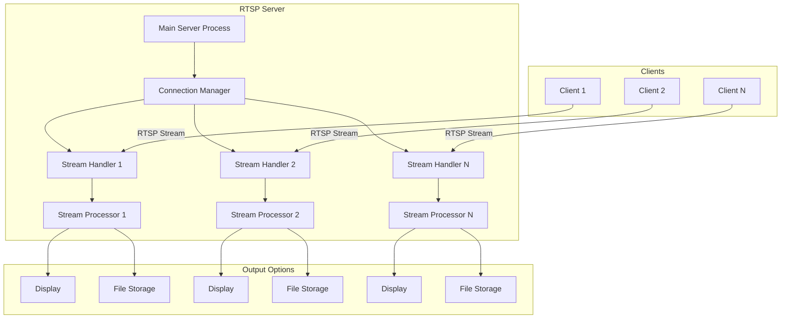

```mermaid
graph TD
    subgraph "RTSP Server"
        A[Main Server Process] --> B[Connection Manager]
        B --> C1[Stream Handler 1]
        B --> C2[Stream Handler 2]
        B --> C3[Stream Handler N]
        C1 --> D1[Stream Processor 1]
        C2 --> D2[Stream Processor 2]
        C3 --> D3[Stream Processor N]
    end
    
    subgraph "Clients"
        E1[Client 1] --> |RTSP Stream| C1
        E2[Client 2] --> |RTSP Stream| C2
        E3[Client N] --> |RTSP Stream| C3
    end
    
    subgraph "Output Options"
        D1 --> F1[Display]
        D1 --> G1[File Storage]
        D2 --> F2[Display]
        D2 --> G2[File Storage]
        D3 --> F3[Display]
        D3 --> G3[File Storage]
    end
```
